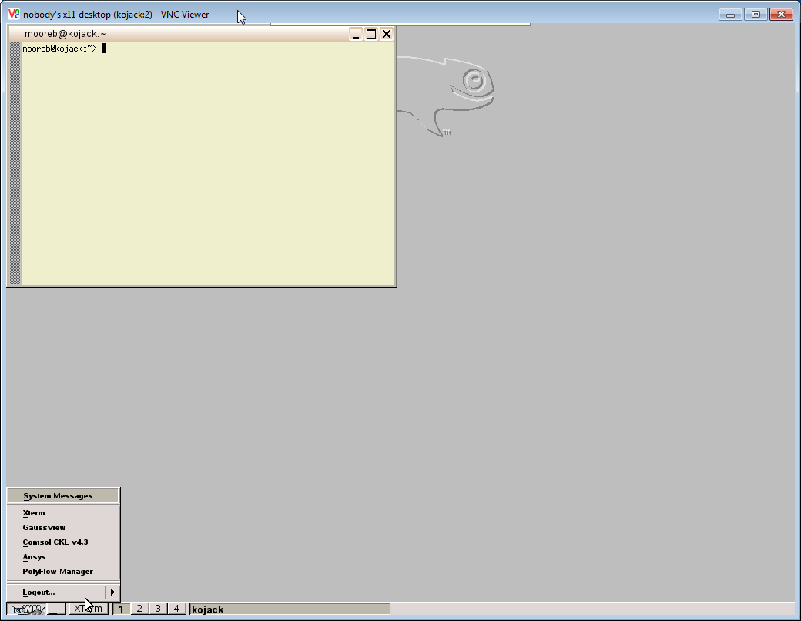

---

[Brian.Moore@sdstate.edu](Brian.Moore@sdstate.edu)  University Networking and Research Computing (UNRC)

---

The SD State Linux cluster
===========

SD State University has a general-purpose Linux cluster for research
computing support. It is a collection of servers (72 in all) connected
to a single dedicated network switch, located in the SDSU Data Center on
the first floor of the Admin. building (SAD 114). Each server has 12
processors and 48 GB RAM; a few of the nodes also have Nvidia Tesla
Graphics Processing cards for GPU computational acceleration. We
generally refer to the cluster as “bigjack” though the main login and
submission node is now `blackjack`.

The cluster has been designed to be as flexible as possible, within the
constraints of the existing hardware and software. There are currently
four nodes of the cluster that users can log in to directly: `blackjack`,
`kojack`, `flapjack` and `bigjack`. Each of these servers takes the same user
credentials and mounts the same home filesystem for the user. Typical
usage scenarios are outlined as follows.

`blackjack`

blackjack is the main development and job submission node of the
    cluster. From this system (and only this) one can submit jobs to the
    worker nodes of the cluster. We try to keep blackjack free of any
    long-running user jobs–those should be run on either the worker
    nodes through the PBS/Moab scheduler or flapjack/kojack.

The cluster job submission system allows a user to run a job on a
    worker node in a dedicated (non-shared) mode. Jobs are queued in a
    mainly first-in/first-out way, being assigned to the first available
    worker node. If all nodes are full, jobs will wait in a queue until
    one becomes available. Since there are serveral nodes, this system
    can work well for high-throughput needs. Also programs that support
    distributed parallelism (e.g. PETSc, NAMD) can be deployed to run on
    several nodes at once.

`kojack`

kojack is targeted as a shared-use visualization node. It will
    accept on-demand VNC sessions; the VNC protocol allows a user to run
    a program requiring a graphical user interface (GUI), for example
    the ANSYS desktop for use in configuring and analyzing ANSYS, or
    GaussView, a GUI program for configuring and analyzing molecular
    systems for the Gaussian program

`flapjack`

flapjack is a develpment node for interactive use.

`bigjack`

bigjack is now mainly a “service” node for cluster and system
    support services (NFS, Moab, etc.)

Cluster management and support: UNRC
====================================

The cluster is managed by the University Networking and Computing (UNRC)
Group underneath the Office of the Vice President of Technology and
Security, Dr. Michael Adelaine. Information about UNRC can be found on
InsideState at
<https://insidestate.sdstate.edu/technology/infotech/Units/network-research>,
and the public web site at
<http://www.sdstate.edu/technology/UNRC/index.cfm>. Main contacts are as
follows:

Kevin Brandt

Unit Manager of UNRC, x5265, SOHO 206A, [kevin.brandt@sdstate.edu](kevin.brandt@sdstate.edu).

Brian Moore

Domain specialist, user support, x4679, SOHO 206A, [brian.moore@sdstate.edu](brian.moore@sdstate.edu).

Al Carter

Research server special projects and support, x5935, SOHO 205, [alan.carter@sdstate.edu](alan.carter@sdstate.edu)

Chad Julius

Cluster System Support and Development, x5592, SOHO 207, [chad.julius@sdstate.edu](chad.julius@sdstate.edu).

Maria Kalyvaki

Domain specialst, HPC facilitation, x4704, SOHO 206D, [maria.kalyvaki@sdstate.edu](maria.kalyvaki@sdstate.edu).

Getting an account
------------------

To request an account on the cluster, fill out as much as
possible of the following short form and email to
[brian.moore@sdstate.edu](brian.moore@sdstate.edu). (The form can also
be found at
<http://www.sdstate.edu/technology/UNRC/Cluster/clusterlogon.cfm>.)

    SDSU research server new account user information
    --------------------------------------------------

    First Name:
    Last Name:

    SDSU ID number:
    (number on front of SDSU ID card)

    SDSU Email address:
    SDSU Department:
    Status (faculty, staff, grad. student [PhD, MS], undergrad.):

    Faculty advisor/sponsor (if applicable):
    Office or Lab location (if applicable):
    Campus Phone:
    Cell Phone, if applicable:

    Research server: (bigjack, pax4, etc.):
    Likely applications to be used (e.g. NAMD, Gaussian, C/MPI, etc.):

Getting Help: Local documentation
---------------------------------

Our link on the public SDSU website is
<http://www.sdstate.edu/technology/UNRC/Cluster/index.cfm>.

UNRC has a Listserv mailing list with periodic announcements for SDSU
research server Linux users. Go to <http://lists.sdstate.edu/scripts>,
and navigate to the UNRC\_RESEARCHCOMPUTING list; you can view previous
messages there, as well as subscribe to the list.

More information on the cluster and UNRC is available on InsideState at
<https://insidestate.sdstate.edu/technology/infotech/Units/network-research/reference/>.
From this link, navigate to Research Computing and then the
Documentation folder.

Getting connected to the cluster: command line shell, file transfers, etc.
==========================================================================

In the sections that follow, we give some information about how to
connect to the servers. In the screenshots, a particular example is
chosen (e.g. flapjack), but the method is the same for all the servers
mentioned, with the exception that kojack is the only one running
on-demand VNC sessions.

Remember, to use the PBS/Moab scheduler, at this time you must be logged
into blackjack.

Network connectivity to blackjack/flapjack/kojack
-------------------------------------------------

In general, the bigjack servers (blackjack/flapjack/kojack) are SDSU
network internal resources only. You need to be within the campus
network to make a connection. If you are using wireless, you need to be
on the SDSUFacStaff network. This means you need a “network account.”
Generally, the existence of a network account is synonymous with the
existence of an email credential of the form
firstname.lastname@sdstate.edu. All employees of the university should
be given network accounts.

In special cases of non-employee researchers, a network account can be
requested by a faculty sponsor for the purpose of accessing research
computing servers. See UNRC contacts for more information on this.

If you are a faculty, post-doc, or graduate student who is doing
frequent work on the cluster, you can request VPN (virtual private
network) credentials. The request form is on InsideState at
<https://insidestate.sdstate.edu/technology/onlineforms>. If you are not
a faculty member, the request will be forwarded through your main
faculty contact (advisor or dept. head) as part of the process. In the
notes section explain that you are asking for VPN to access research
servers and explain your situation as fully as possible.

If you can access cloudapps (<https://cloudapps.sdstate.edu/>), you can
connect to a virtual Windows machine very similar to the on-campus lab
computers. This is an internal resource, once you make the connection,
so you can then use connection tools (such a PuTTY, described below) to
connect to research servers including the cluser.

How to get connected–command line interaction
---------------------------------------------

All of the cluster servers which take logins from the outside
(blackjack, kojack, flapjack) can be accessed with a command-line shell
program. This is the most basic level of interaction which is available
for all servers. In addition, especially for Windows, most users find it
convenient to also install a file transfer helper program. A few servers
(kojack) are also set up for remote graphical interface connections,
through VNC view programs. We’ll mention VNC briefly here, but if you
find yourself wanting to use that, we have a more detailed help document
just for VNC.

### Windows

You will need to download a program to make a command-line terminal
connection. There are several alternatives, but a typical choice is
PuTTY,
<http://www.chiark.greenend.org.uk/~sgtatham/putty/download.html>. You
can download and run the Windows installer, or you can just download the
executable of the program itself, putty.exe, and put it directly on your
desktop.

When you start PuTTY, you will be presented with a connection screen.
Assuming you want to make your first connection to flapjack, enter
flapjack.jacks.local in the Host Name field.

When you click Open you should see the black PuTTY terminal window
appear and then a message similar to the following.

This message about the encryption key should appear only the *first*
time you connect to a given server from a particular computer. PuTTY is
an encrypted protocol, but the initial connection has to be made in the
clear to transfer the key. So click Yes. Then you will see the login
prompt for the server. Enter your username and then your password. Note
that no characters will appear at all as you type the password.

When you have successfully logged in you will see the motd and the
command line system prompt.

### Mac

For the Mac OS it is a similar process, but you can use the Terminal app
in the Utilities folder under you Applications folder. One way to
quickly open Utilities is from the Go menu of Finder. Then go to the
Terminal application and open it. This brings up a local command line
window on your Mac. From that command prompt, use the ssh command to
connect.

File transfer helper programs
-----------------------------

### Windows

A typical choice is WinSCP, <http://winscp.net/eng/index.php>. Again,
you have a choice of downloading either a Windows installer or a
standalone executable. When you download the portable executable, it
will come as a zipped folder. Expand the folder and move the WinSCP.exe
onto your desktop. The initial screen is similar to the PuTTY connection
window. Enter the name of the server you want to connect to (e.g.
flapjack.jacks.local) and click Login.

It will give you a warning about transferring the encryption key for the
first time connection, then you will see screens where you enter your
username and password for the server. After that, you are presented with
a screen showing a view of the filesystems on both systems in two
side-by-side windows.

Now at this point you can navigate your file systems independently
within each window, find the file you want to transfer, then transfer it
either by dragging and dropping, or using the context menu (right click
on a file) to see the options.

### Mac

A good choice here is to download the FileZilla Client
(<https://filezilla-project.org/>). Once installed and started, it
functions similar to WinSCP.

Note here that we enter the server name with the prefix sftp:// to force
the secure ftp protocol. Another way to ensure this is to put 22 in the
Port entry. Otherwise, FileZilla runs in a similar way to WinSCP.

Remote graphics connections: VNC
--------------------------------

### Obtaining and installing VNC

Free VNC viewer programs are available from RealVNC at
<https://www.realvnc.com/download/viewer/>. What you want is just the
viewer program, not a server. Versions are available for Mac, Windows
and Linux.

### On-demand VNC session

Currently, `kojack` is configured to accept on-demand VNC connections on
screens 1 and 2. The difference between the screens is resolution;
screen 2 is slightly larger. To make the connection, start the VNC
viewer program and enter `kojack:1` in the window.

If you are successful at making the connection, you will see a login
window:

Enter your cluster (`bigjack`) credentials to log in to the system. Note
that even though this is a different system, `kojack`, it shares the
same user credentials and home file system with `bigjack`. When you are
logged in, you will see a simple desktop, something like:

Notice that if you click on the “IceWM” button in lower left, you will
get a short list of some of the programs we frequently use on the
system, such as gaussview. For custom commands, run from the command
line out of an xterm session

To leave your session, you can log out from the IceWM button, or you can
just kill the program on your desktop (with the X button). Either way,
your session will be closed and terminated. Any programs running in the
session will be terminated.

Next steps
==========

So far, this document has only talked about what the systems are, how to
get information and help, and how to get logged on. We have not at all
about how to actually *do* anything! First of all, make sure to take
note of the section above: How to get help. We have help documents on
our InsideState page; we distribute information through the listserv
(and remember, you don’t have to be a subscriber to see the posts; you
can go to the listserv website to see all postings); and finally and
most importantly, you are welcome to call, email or visit the UNRC
research computing support staff for any questions.

Typically, the first step for a new user after getting connected and
understanding the system is to learn some more basic Linux command line
skills. We have a help document on that topic that can be retrieved from
the InsideState page or by email request. This document shows how to do
basic utility tasks such as viewing files, moving, copying, changing
password etc., but also gives some basic examples of compiling and
running a program from the command line interacively.

Once you have the ability to move files around, run programs
interactively, you might then want to learn how to run programs on the
worker nodes through the PBS/Moab scheduler. There is a help document on
our site that should help you get started with that.

Also, if you look in the folder `/home/mooreb/examples`, you will find a
directory tree with simple examples that might work as templates for
your jobs or give you ideas how to do something.
